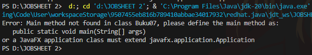
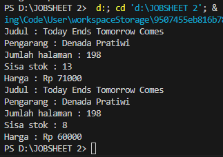
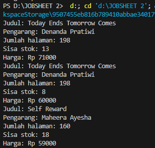
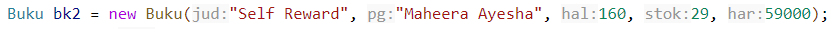

# LAPORAN PRAKTIKUM 2 ALGORITMA DAN STRUKTUR DATA

Nama: Cakra Wangsa M.A.W

Kelas: TI1H

NIM: 2341720032

Prodi: D4 TEKNIK INFORMATIKA

Absen: 07

### 2.1 Percobaan 1: Deklarasi Class, Atribut dan Method


### 2.1.1 LANGKAH LANGKAH PERCOBAAN
``` java
    public class Buku07 {
        
        String judul, pengarang;
        int halaman, stok, harga;

        void tampilInformasi(){
            System.out.println("Judul : " + judul);
            System.out.println("Pengarang : " + pengarang);
            System.out.println("Jumlah halaman : " + halaman);
            System.out.println("Sisa stok : " + stok);
            System.out.println("Harga : Rp " + harga);
        }

        void terjual (int jml) {
            stok -= jml;
        }

        void restock (int jml) {
            stok += jml;
        }

        void gantiHarga(int hrg) {
            harga = hrg;
        }
    }
    
```

### 2.1.2 Verifikasi hasil percobaan




## PERTANYAAN 1

1. Sebutkan dua karakteristik class atau object!

    jawab: 
    karena memiliki method dan atribut 

2. Perhatikan class Buku pada Praktikum 1 tersebut, ada berapa atribut yang dimiliki oleh class Buku? Sebutkan apa saja atributnya!

    jawab: 
    Class Buku07 memiliki lima atribut. Yaitu:
    judul (bertipe String): Menyimpan judul dari buku.
    pengarang (bertipe String): Menyimpan nama pengarang dari buku.
    halaman (bertipe int): Menyimpan jumlah halaman dari buku.
    stok (bertipe int): Menyimpan jumlah stok buku yang tersedia.
    harga (bertipe int): Menyimpan harga buku dalam format rupiah.

3. Ada berapa method yang dimiliki oleh class tersebut? Sebutkan apa saja methodnya!

    jawab:
``` java 
    Terdapat 4 Method yang terdapat pada kode program yaitu 
    void tampilInformasi(), terjual (int jml), restock (int jml), gantiHarga(int hrg)
```

4. Perhatikan method terjual() yang terdapat di dalam class Buku. Modifikasi isi method tersebut sehingga proses pengurangan hanya dapat dilakukan jika stok masih ada (lebih besar dari 0)!

jawab:
``` java
void terjual (int jml) {
            if (stok > 0) {
            stok -= jml;
        }
     }
```

5. Menurut Anda, mengapa method restock() mempunyai satu parameter berupa bilangan int?

    Jawab:
    karena parameter tersebut digunakan untuk menentukan jumlah stok yang akan ditambahkan kembali. Dengan menggunakan parameter ini, kita dapat mengatur berapa banyak barang yang akan di-restock ke dalam stok buku.

6. Commit dan push kode program ke Github


### 2.2 Percobaan 2: Instansiasi Object, serta Mengakses Atribut dan Method

### 2.2.1 Langkah-langkah Percobaan

``` java
public class BukuMain07 {
  
    public static void main(String[] args) {
        Buku07 bkl = new Buku07();
        bkl.judul = "Today Ends Tomorrow Comes";
        bkl.pengarang = "Denada Pratiwi";
        bkl.halaman = 198;
        bkl.stok = 13;
        bkl.harga = 71000;

        bkl.tampilInformasi();
        bkl.terjual(5);
        bkl.gantiHarga(60000);
        bkl.tampilInformasi();
    } 
}
```

### 2.2.2 Verifikasi hasil percobaan program


### PERTANYAAN

1. Pada class BukuMain, tunjukkan baris kode program yang digunakan untuk proses instansiasi! Apa nama object yang dihasilkan?

    Jawab:
    baris kode program yang digunakan untuk proses inisialisasi adalah 
    ``` java
    Buku07 bkl = new Buku07();
    ```
    Baris ini menciptakan sebuah objek dari kelas Buku07 dan menyimpannya dalam variabel bkl. Objek ini akan memiliki atribut seperti judul, pengarang, halaman, stok, dan harga yang dapat diakses dan dimanipulasi melalui metode-metode yang didefinisikan dalam kelas Buku07.
    ``` java
    Nama objek yang dihasilkan adalah bkl. Dengan menggunakan objek ini, kita dapat memanggil metode-metode seperti tampilInformasi(), terjual(), dan gantiHarga() untuk mengelola informasi buku tersebut1.
    ```

2. Bagaimana cara mengakses atribut dan method dari suatu objek?

    Jawab: 
    Pada class BukuMain di kode program di atas, kita dapat mengakses atribut dan method dari suatu objek dengan menggunakan objek yang telah kita buat. Dengan cara mengakses Atribut (variabel), Untuk mengakses atribut (variabel) dari objek, kita gunakan nama objek diikuti oleh tanda titik (.) dan nama atribut yang ingin diakses. Dan akses Method (fungsi), Untuk mengakses method (fungsi) dari objek, kita juga gunakan nama objek diikuti oleh tanda titik (.) dan nama method yang ingin dipanggil.

3. Mengapa hasil output pemanggilan method tampilInformasi() pertama dan kedua berbeda?

    Jawab:
    Hasil output pemanggilan method tampilInformasi() pada kode program di atas berbeda karena nilai atribut dari objek bkl telah mengalami perubahan setelah pemanggilan method terjual(5) dan method gantiHarga(60000).


### 2.3 Percobaan 3: Membuat Konstruktor

### 2.3.1 Langkah-langkah Percobaan


``` java
public class Buku07 {

    String judul, pengarang;
    int halaman, stok, harga;

    void tampilInformasi(){
        System.out.println("Judul: " + judul);
        System.out.println("Pengarang: " + pengarang);
        System.out.println("Jumlah halaman: " + halaman);
        System.out.println("Sisa stok: " + stok);
        System.out.println("Harga: Rp " + harga);
    }

    void terjual(int jml){
        if (stok > 0) {
            stok -= jml;
        }
    }
    
    void restock(int jml){
        stok += jml;
    }

    void gantiHarga(int hrg){
        harga = hrg;
    }

    public Buku07(){
        
    }

    public Buku07(String jud, String pg, int hal, int stok, int har){
        judul = jud;
        pengarang = pg;
        halaman = hal;
        this.stok = stok;
        harga = har;
    }
}
```

``` java

public class BukuMain07 {
    public static void main(String[] args) {
        Buku07 bk1 = new Buku07();
        bk1.judul = "Today Ends Tomorrow Comes";
        bk1.pengarang = "Denanda Pratiwi";
        bk1.halaman = 198;
        bk1.stok = 13;
        bk1.harga = 71000;

        bk1.tampilInformasi();
        bk1.terjual(5);
        bk1.gantiHarga(60000);
        bk1.tampilInformasi();

        Buku07 bk2 = new Buku07("Self Reward", "Maheera Ayesha", 160, 29, 59000);
        bk2.terjual(11);
        bk2.tampilInformasi();
        
        Buku07 bukuCakra = new Buku07("Laskar Pelangi", "Andrea Hinata", 534, 19, 290000);
    }
}
```

### 2.3.2 Verifikasi Hasil Percobaan



### 2.3.3 Pertanyaan

1. Pada class Buku di Percobaan 3, tunjukkan baris kode program yang digunakan untuk mendeklarasikan konstruktor berparameter!

Jawab:

``` java
    public Buku07(String jud, String pg, int hal, int stok, int har){
        judul = jud;
        pengarang = pg;
        halaman = hal;
        this.stok = stok;
        harga = har;
    }
```

    Konstruktor berparameter ini mengambil lima parameter: judul, pengarang, jumlah halaman, stok, dan harga. Lalu, konstruktor ini menginisialisasi atribut-atribut dari objek Buku07 dengan nilai-nilai yang diberikan sebagai parameter.


2. Perhatikan class BukuMain. Apa sebenarnya yang dilakukan pada baris program berikut?


    Jawab:
     baris tersebut melakukan pembuatan objek bk2 dan akan langsung menginisialisasi pada constructor.

3. Hapus konstruktor default pada class Buku, kemudian compile dan run program. Bagaimana hasilnya? Jelaskan mengapa hasilnya demikian!

    Jawab:
    Jika konstruktor default yang ada pada class Buku itu dihapus maka akan terjadi error pada output BukuMain dengan kode "The constructor Buku07() is undefined'. Dengan begitu BukuMain07 akan mencoba untuk memanggil constructor default sedangkanyang ada di Buku07 constructor default tidak ada.

4. Setelah melakukan instansiasi object, apakah method di dalam class Buku harus diakses secara berurutan? Jelaskan alasannya!

    Jawab:
    tidak harus, karena method yang ada di dalam class Buku bisa dipanggil meskipun tidak berurutan.

5. Buat object baru dengan nama buku (NamaMahasiswa) menggunakan konstruktor berparameter dari class Buku!

    Jawab:
    ``` java
    Buku07 bukuCakra = new Buku07("Laskar Pelangi", "Andrea Hinata", 534, 19, 290000);
    ```
6. Commit dan push kode program ke Github


### 2.4 Latihan Praktikum

1. Pada class Buku yang telah dibuat, tambahkan tiga method yaitu hitungHargaTotal(), hitungDiskon(), dan hitungHargaBayar() dengan penjelasan sebagai berikut:
o
Method hitungHargaTotal() digunakan untuk menghitung harga total yang merupakan perkalian antara harga dengan jumlah buku yang terjual
o
Method hitungDiskon() digunakan untuk menghitung diskon dengan aturan berikut:
▪
Jika harga total lebih dari 150000, maka harga didiskon sebesar 12%
▪
Jika harga total antara 75000 sampai 150000, maka harga didiskon sebesar 5% Jika harga total kurang dari 75000, maka harga tidak didiskon
o
Method hitungHargaBayar() digunakan untuk menghitung harga total setelah dikurangi diskon
Class diagram Buku setelah penambahan ketiga method tersebut adalah sebagai berikut.

    

    KODE PROGRAM

``` java

    public class Buku07 {

    String judul, pengarang;
    int halaman, stok, harga;

    void tampilInformasi(){
        System.out.println("Judul: " + judul);
        System.out.println("Pengarang: " + pengarang);
        System.out.println("Jumlah halaman: " + halaman);
        System.out.println("Sisa stok: " + stok);
        System.out.println("Harga: Rp " + harga);
    }
    
    void terjual(int jml){
        if (stok > 0) {
            stok -= jml;
        }
    }
    
    void restock(int jml){
        stok += jml;
    }

    void gantiHarga(int hrg){
        harga = hrg;
    }

    int hitungHargaTotal(int terjual){
        int total = harga * terjual;
        return total;

    }

    double hitungDiskon(int total){
        double diskon = 0;
        if (total > 150000) {
            diskon = total * 0.12;
        } else if (total > 75000) {
            diskon = total * 0.05;
        } 
        return diskon;

    }

    int hitungHargaBayar(int hargaDiskon, double hargaTotal){
        int tagihan =  (int)hargaTotal - hargaDiskon;
        return tagihan;
    }

    public Buku07(){
        
    }

    public Buku07(String jud, String pg, int hal, int stok, int har){
        judul = jud;
        pengarang = pg;
        halaman = hal;
        this.stok = stok;
        harga = har;
    }
}
```

``` java
public class BukuMain07 {
    public static void main(String[] args) {
        Buku07 bk1 = new Buku07();
        bk1.judul = "Today Ends Tomorrow Comes";
        bk1.pengarang = "Denanda Pratiwi";
        bk1.halaman = 198;
        bk1.stok = 13;
        bk1.harga = 71000;

        bk1.tampilInformasi();
        bk1.terjual(5);
        bk1.gantiHarga(60000);
        bk1.tampilInformasi();
        
        int totalHarga = bk1.hitungHargaTotal(8);
        System.out.println("Toal Harga: "+ totalHarga);
        double diskon = bk1.hitungDiskon(totalHarga);
        System.out.println("Diskon: "+ diskon);
        int hargaBayar = bk1.hitungHargaBayar(totalHarga,(int) diskon);
        System.out.println("Bayar: "+ hargaBayar);

        Buku07 bk2 = new Buku07("Self Reward", "Maheera Ayesha", 160, 29, 59000);
        bk2.terjual(11);
        bk2.tampilInformasi();
        
        Buku07 bukuCakra = new Buku07("Laskar Pelangi", "Andrea Hinata", 534, 19, 290000);
        bukuCakra.terjual(9);
        bukuCakra.tampilInformasi();
    }
}
```

2. Buat program berdasarkan class diagram berikut ini!
    
    

    Penjelasan dari atribut dan method pada class Dragon tersebut adalah sebagai berikut:
    •
    Atribut x digunakan untuk menyimpan posisi koordinat x (mendatar) dari dragon, sedangkan atribut y untuk posisi koordinat y (vertikal)
    •
    Atribut width digunakan untuk menyimpan lebar dari area permainan, sedangkan height untuk menyimpan panjang area
    •
    Method moveLeft() digunakan untuk mengubah posisi dragon ke kiri (koordinat x akan berkurang 1), sedangkan moveRight() untuk bergerak ke kanan (koordinat x akan bertambah 1). Perlu diperhatikan bahwa koordinat x tidak boleh lebih kecil dari 0 atau lebih besar dari nilai width. Jika koordinat x < 0 atau x > width maka panggil method detectCollision()
    •
    Method moveUp() digunakan untuk mengubah posisi dragon ke atas (koordinat y akan berkurang 1), sedangkan moveDown() untuk bergerak ke bawah (koordinat y akan bertambah 1). Perlu diperhatikan bahwa koordinat y tidak boleh lebih kecil dari 0 atau lebih besar dari
    nilai height. Jika koordinat y < 0 atau y > height maka panggil method detectCollision()
    •
    Method detectCollision() akan mencetak pesan “Game Over” apabila dragon menyentuh ujung area permainan.

KODE PROGRAM

``` java
public class Dragon {
    int x, y, width, height;
    
    void moveLeft(){
        x -= 1;
        printPosition();
    }

    void moveRight(){
        x += 1;
        printPosition();
    }

    void moveUp(){
        y -= 1;
    }

    void moveDown(){
        y += 1;
    }

    void printPosition(){
        System.out.println("Posisi Dragon: "+ x + ", " + y);

    }

    void detectCollision(int x, int y){
        if (x < 0 || x == width || y == height || y > 0 ) {
            System.out.println("Game Over");
        }
    }

    public Dragon(int xdragon, int ydragon, int mapwidht, int mapheight){
        x = xdragon;
        y = ydragon;
        width = mapwidht;
        height = mapheight;
    }
}
```

``` java
public class DragonMain {
    public static void main(String[] args) {
        Dragon fire = new Dragon(4, 1, 10, 10);
        
        fire.moveDown();
        fire.moveLeft();
        fire.moveUp();
        fire.moveRight();
    }
}
```